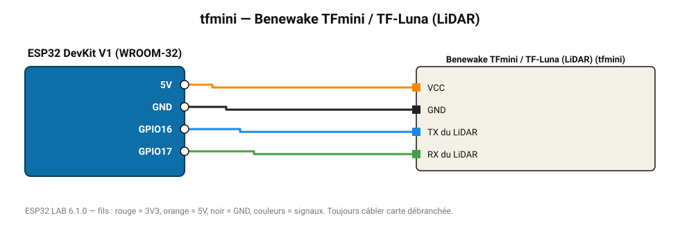

# Benewake TFmini / TF-Luna (LiDAR)

LiDAR ToF 0,2-8 m (TF-Luna) / 12 m (TFmini) à 100 Hz, trame série 9 octets.

**Carte :** ESP32 DevKit V1 (WROOM-32) — moniteur série 115200 bauds.

| ESP32 | Composant | Broche | Couleur fil | Remarque |
|---|---|---|---|---|
| 5V (VIN) | Benewake TFmini / TF-Luna (LiDAR) | VCC | orange |  |
| GND | Benewake TFmini / TF-Luna (LiDAR) | GND | noir |  |
| GPIO16 | Benewake TFmini / TF-Luna (LiDAR) | TX du LiDAR | bleu |  |
| GPIO17 | Benewake TFmini / TF-Luna (LiDAR) | RX du LiDAR | vert |  |

Toujours câbler **carte débranchée**. Masse (GND) commune entre tous les modules.
