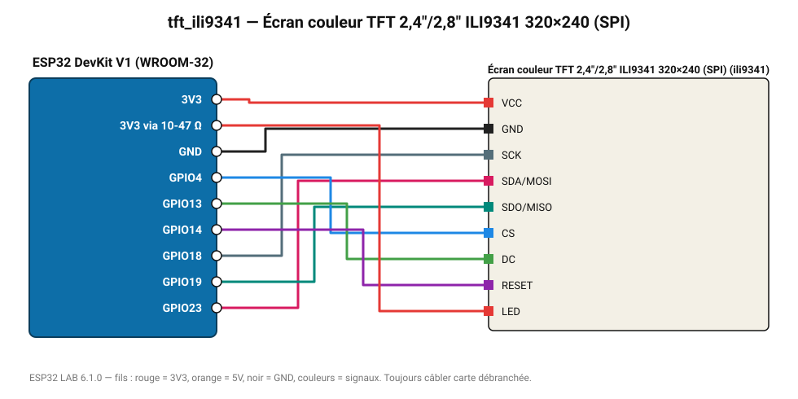

# Écran couleur TFT 2,4"/2,8" ILI9341 320×240 (SPI)

Grand écran couleur 320×240 : tableau de bord lisible de loin.

**Carte :** ESP32 DevKit V1 (WROOM-32) — moniteur série 115200 bauds.

| ESP32 | Composant | Broche | Couleur fil | Remarque |
|---|---|---|---|---|
| 3V3 | Écran couleur TFT 2,4"/2,8" ILI9341 320×240 (SPI) | VCC | rouge |  |
| GND | Écran couleur TFT 2,4"/2,8" ILI9341 320×240 (SPI) | GND | noir |  |
| GPIO18 | Écran couleur TFT 2,4"/2,8" ILI9341 320×240 (SPI) | SCK | gris-bleu |  |
| GPIO23 | Écran couleur TFT 2,4"/2,8" ILI9341 320×240 (SPI) | SDA/MOSI | rose |  |
| GPIO19 | Écran couleur TFT 2,4"/2,8" ILI9341 320×240 (SPI) | SDO/MISO | turquoise |  |
| GPIO4 | Écran couleur TFT 2,4"/2,8" ILI9341 320×240 (SPI) | CS | bleu |  |
| GPIO13 | Écran couleur TFT 2,4"/2,8" ILI9341 320×240 (SPI) | DC | vert |  |
| GPIO14 | Écran couleur TFT 2,4"/2,8" ILI9341 320×240 (SPI) | RESET | violet |  |
| 3V3 via 10-47 Ω | Écran couleur TFT 2,4"/2,8" ILI9341 320×240 (SPI) | LED | rouge |  |

Toujours câbler **carte débranchée**. Masse (GND) commune entre tous les modules.
