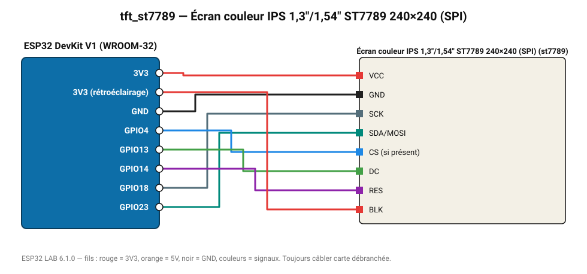

# Écran couleur IPS 1,3"/1,54" ST7789 240×240 (SPI)

Écran IPS carré haute définition, angles de vision larges.

**Carte :** ESP32 DevKit V1 (WROOM-32) — moniteur série 115200 bauds.

| ESP32 | Composant | Broche | Couleur fil | Remarque |
|---|---|---|---|---|
| 3V3 | Écran couleur IPS 1,3"/1,54" ST7789 240×240 (SPI) | VCC | rouge |  |
| GND | Écran couleur IPS 1,3"/1,54" ST7789 240×240 (SPI) | GND | noir |  |
| GPIO18 | Écran couleur IPS 1,3"/1,54" ST7789 240×240 (SPI) | SCK | gris-bleu |  |
| GPIO23 | Écran couleur IPS 1,3"/1,54" ST7789 240×240 (SPI) | SDA/MOSI | turquoise |  |
| GPIO4 | Écran couleur IPS 1,3"/1,54" ST7789 240×240 (SPI) | CS (si présent) | bleu |  |
| GPIO13 | Écran couleur IPS 1,3"/1,54" ST7789 240×240 (SPI) | DC | vert |  |
| GPIO14 | Écran couleur IPS 1,3"/1,54" ST7789 240×240 (SPI) | RES | violet |  |
| 3V3 (rétroéclairage) | Écran couleur IPS 1,3"/1,54" ST7789 240×240 (SPI) | BLK | rouge |  |

Toujours câbler **carte débranchée**. Masse (GND) commune entre tous les modules.
