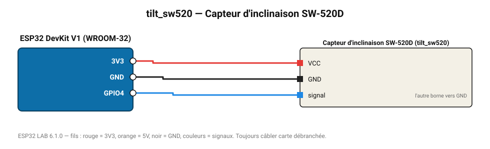

# Capteur d'inclinaison SW-520D

Bille métallique qui ferme le contact au-delà d'environ 45°.

**Carte :** ESP32 DevKit V1 (WROOM-32) — moniteur série 115200 bauds.

| ESP32 | Composant | Broche | Couleur fil | Remarque |
|---|---|---|---|---|
| 3V3 | Capteur d'inclinaison SW-520D | VCC | rouge |  |
| GND | Capteur d'inclinaison SW-520D | GND | noir |  |
| GPIO4 | Capteur d'inclinaison SW-520D | signal | bleu | l'autre borne vers GND |

Toujours câbler **carte débranchée**. Masse (GND) commune entre tous les modules.
