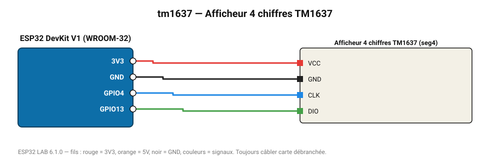

# Afficheur 4 chiffres TM1637

Afficheur 7 segments 4 chiffres avec deux-points : montre la première mesure du projet (ou un compteur).

**Carte :** ESP32 DevKit V1 (WROOM-32) — moniteur série 115200 bauds.

| ESP32 | Composant | Broche | Couleur fil | Remarque |
|---|---|---|---|---|
| 3V3 | Afficheur 4 chiffres TM1637 | VCC | rouge |  |
| GND | Afficheur 4 chiffres TM1637 | GND | noir |  |
| GPIO4 | Afficheur 4 chiffres TM1637 | CLK | bleu |  |
| GPIO13 | Afficheur 4 chiffres TM1637 | DIO | vert |  |

Toujours câbler **carte débranchée**. Masse (GND) commune entre tous les modules.
