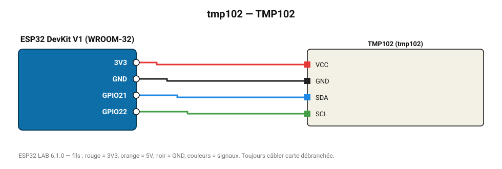

# TMP102

Minuscule thermomètre TI ±0,5 °C, lecture directe du registre 12 bits.

**Carte :** ESP32 DevKit V1 (WROOM-32) — moniteur série 115200 bauds.

| ESP32 | Composant | Broche | Couleur fil | Remarque |
|---|---|---|---|---|
| 3V3 | TMP102 | VCC | rouge |  |
| GND | TMP102 | GND | noir |  |
| GPIO21 | TMP102 | SDA | bleu |  |
| GPIO22 | TMP102 | SCL | vert |  |

Toujours câbler **carte débranchée**. Masse (GND) commune entre tous les modules.
