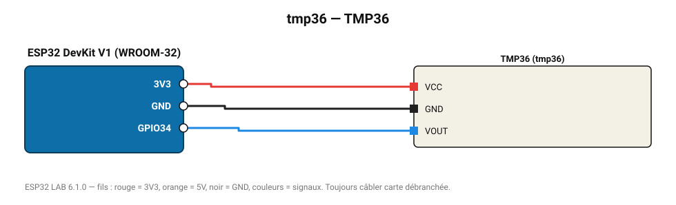

# TMP36

Capteur analogique -40 à 125 °C : 10 mV/°C avec décalage de 500 mV.

**Carte :** ESP32 DevKit V1 (WROOM-32) — moniteur série 115200 bauds.

| ESP32 | Composant | Broche | Couleur fil | Remarque |
|---|---|---|---|---|
| 3V3 | TMP36 | VCC | rouge |  |
| GND | TMP36 | GND | noir |  |
| GPIO34 | TMP36 | VOUT | bleu |  |

Toujours câbler **carte débranchée**. Masse (GND) commune entre tous les modules.
