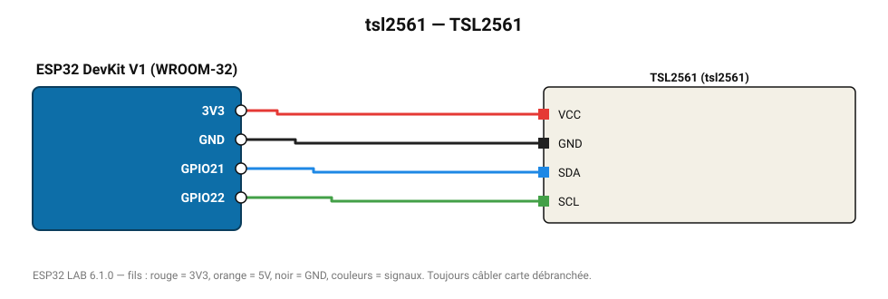

# TSL2561

Luxmètre à deux photodiodes (visible + IR) : 0,1-40 000 lx, proche de la vision humaine.

**Carte :** ESP32 DevKit V1 (WROOM-32) — moniteur série 115200 bauds.

| ESP32 | Composant | Broche | Couleur fil | Remarque |
|---|---|---|---|---|
| 3V3 | TSL2561 | VCC | rouge |  |
| GND | TSL2561 | GND | noir |  |
| GPIO21 | TSL2561 | SDA | bleu |  |
| GPIO22 | TSL2561 | SCL | vert |  |

Toujours câbler **carte débranchée**. Masse (GND) commune entre tous les modules.
