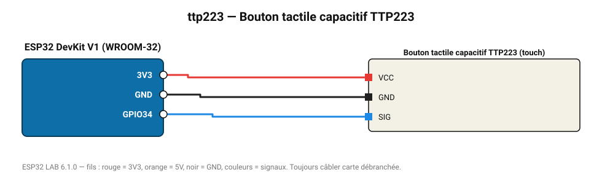

# Bouton tactile capacitif TTP223

Touche sensitive : fonctionne à travers 2-3 mm de plastique ou de verre.

**Carte :** ESP32 DevKit V1 (WROOM-32) — moniteur série 115200 bauds.

| ESP32 | Composant | Broche | Couleur fil | Remarque |
|---|---|---|---|---|
| 3V3 | Bouton tactile capacitif TTP223 | VCC | rouge |  |
| GND | Bouton tactile capacitif TTP223 | GND | noir |  |
| GPIO34 | Bouton tactile capacitif TTP223 | SIG | bleu |  |

Toujours câbler **carte débranchée**. Masse (GND) commune entre tous les modules.
