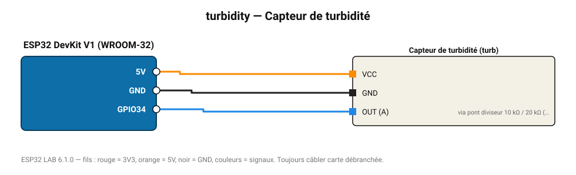

# Capteur de turbidité

Mesure la clarté de l'eau (NTU) par diffusion infrarouge.

**Carte :** ESP32 DevKit V1 (WROOM-32) — moniteur série 115200 bauds.

| ESP32 | Composant | Broche | Couleur fil | Remarque |
|---|---|---|---|---|
| 5V (VIN) | Capteur de turbidité | VCC | orange |  |
| GND | Capteur de turbidité | GND | noir |  |
| GPIO34 | Capteur de turbidité | OUT (A) | bleu | via pont diviseur 10 kΩ / 20 kΩ (sortie 0-4,5 V) |

Toujours câbler **carte débranchée**. Masse (GND) commune entre tous les modules.
