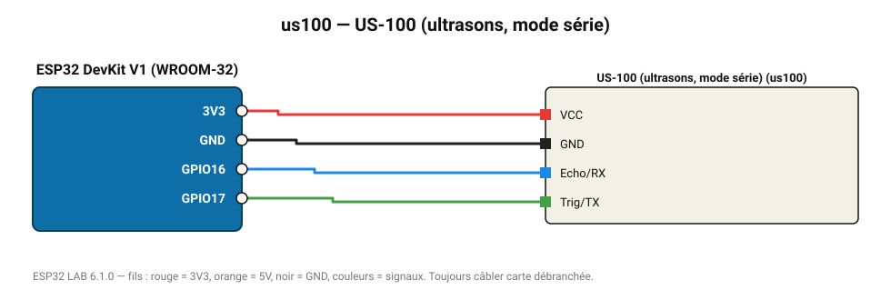

# US-100 (ultrasons, mode série)

Télémètre à ultrasons avec compensation de température, lu en mode UART (cavalier en place).

**Carte :** ESP32 DevKit V1 (WROOM-32) — moniteur série 115200 bauds.

| ESP32 | Composant | Broche | Couleur fil | Remarque |
|---|---|---|---|---|
| 3V3 | US-100 (ultrasons, mode série) | VCC | rouge |  |
| GND | US-100 (ultrasons, mode série) | GND | noir |  |
| GPIO16 | US-100 (ultrasons, mode série) | Echo/RX | bleu |  |
| GPIO17 | US-100 (ultrasons, mode série) | Trig/TX | vert |  |

Toujours câbler **carte débranchée**. Masse (GND) commune entre tous les modules.
