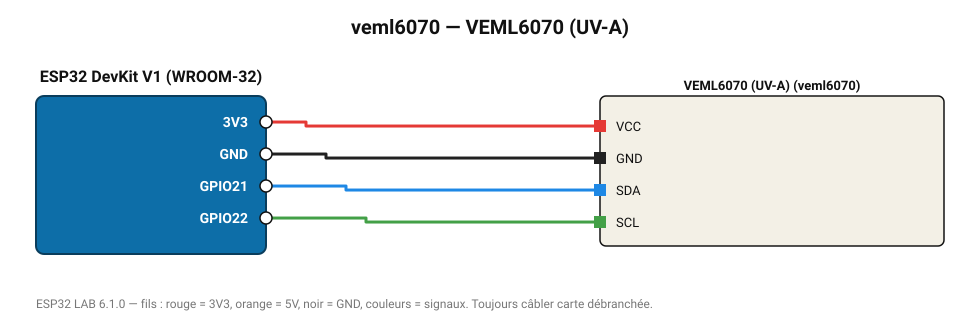

# VEML6070 (UV-A)

Capteur UV-A Vishay (320-410 nm).

**Carte :** ESP32 DevKit V1 (WROOM-32) — moniteur série 115200 bauds.

| ESP32 | Composant | Broche | Couleur fil | Remarque |
|---|---|---|---|---|
| 3V3 | VEML6070 (UV-A) | VCC | rouge |  |
| GND | VEML6070 (UV-A) | GND | noir |  |
| GPIO21 | VEML6070 (UV-A) | SDA | bleu |  |
| GPIO22 | VEML6070 (UV-A) | SCL | vert |  |

Toujours câbler **carte débranchée**. Masse (GND) commune entre tous les modules.
