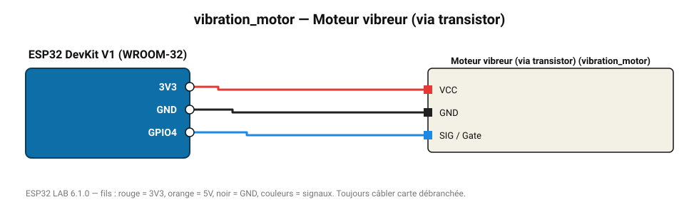

# Moteur vibreur (via transistor)

Petit moteur à masselotte : retour haptique, alerte silencieuse.

**Carte :** ESP32 DevKit V1 (WROOM-32) — moniteur série 115200 bauds.

| ESP32 | Composant | Broche | Couleur fil | Remarque |
|---|---|---|---|---|
| 3V3 | Moteur vibreur (via transistor) | VCC | rouge |  |
| GND | Moteur vibreur (via transistor) | GND | noir |  |
| GPIO4 | Moteur vibreur (via transistor) | SIG / Gate | bleu |  |

Toujours câbler **carte débranchée**. Masse (GND) commune entre tous les modules.
