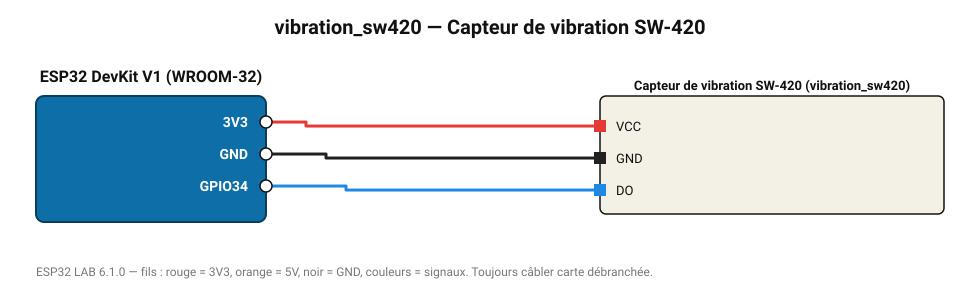

# Capteur de vibration SW-420

Module à ressort + comparateur : chocs et vibrations (antivol, machine).

**Carte :** ESP32 DevKit V1 (WROOM-32) — moniteur série 115200 bauds.

| ESP32 | Composant | Broche | Couleur fil | Remarque |
|---|---|---|---|---|
| 3V3 | Capteur de vibration SW-420 | VCC | rouge |  |
| GND | Capteur de vibration SW-420 | GND | noir |  |
| GPIO34 | Capteur de vibration SW-420 | DO | bleu |  |

Toujours câbler **carte débranchée**. Masse (GND) commune entre tous les modules.
