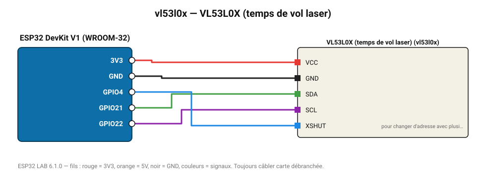

# VL53L0X (temps de vol laser)

Télémètre laser ToF 30-1200 mm, précis et insensible à la couleur de la cible.

**Carte :** ESP32 DevKit V1 (WROOM-32) — moniteur série 115200 bauds.

| ESP32 | Composant | Broche | Couleur fil | Remarque |
|---|---|---|---|---|
| 3V3 | VL53L0X (temps de vol laser) | VCC | rouge |  |
| GND | VL53L0X (temps de vol laser) | GND | noir |  |
| GPIO21 | VL53L0X (temps de vol laser) | SDA | vert |  |
| GPIO22 | VL53L0X (temps de vol laser) | SCL | violet |  |
| GPIO4 | VL53L0X (temps de vol laser) | XSHUT | bleu | pour changer d'adresse avec plusieurs capteurs |

Toujours câbler **carte débranchée**. Masse (GND) commune entre tous les modules.
