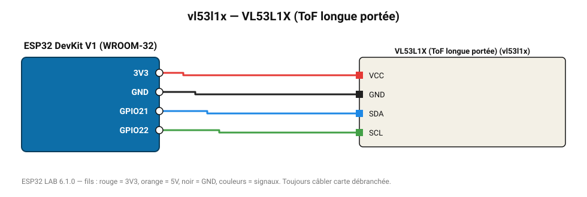

# VL53L1X (ToF longue portée)

Télémètre laser ToF jusqu'à 4 m, mesure continue 50 Hz.

**Carte :** ESP32 DevKit V1 (WROOM-32) — moniteur série 115200 bauds.

| ESP32 | Composant | Broche | Couleur fil | Remarque |
|---|---|---|---|---|
| 3V3 | VL53L1X (ToF longue portée) | VCC | rouge |  |
| GND | VL53L1X (ToF longue portée) | GND | noir |  |
| GPIO21 | VL53L1X (ToF longue portée) | SDA | bleu |  |
| GPIO22 | VL53L1X (ToF longue portée) | SCL | vert |  |

Toujours câbler **carte débranchée**. Masse (GND) commune entre tous les modules.
