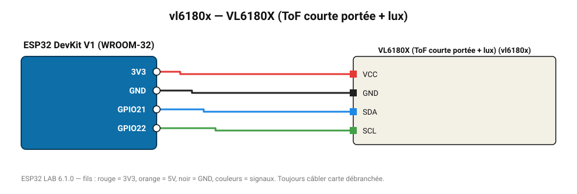

# VL6180X (ToF courte portée + lux)

Mesure de 5 à 200 mm au millimètre près, plus un capteur de lumière ambiante.

**Carte :** ESP32 DevKit V1 (WROOM-32) — moniteur série 115200 bauds.

| ESP32 | Composant | Broche | Couleur fil | Remarque |
|---|---|---|---|---|
| 3V3 | VL6180X (ToF courte portée + lux) | VCC | rouge |  |
| GND | VL6180X (ToF courte portée + lux) | GND | noir |  |
| GPIO21 | VL6180X (ToF courte portée + lux) | SDA | bleu |  |
| GPIO22 | VL6180X (ToF courte portée + lux) | SCL | vert |  |

Toujours câbler **carte débranchée**. Masse (GND) commune entre tous les modules.
