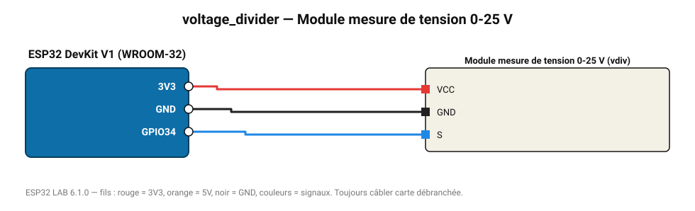

# Module mesure de tension 0-25 V

Pont diviseur 30 kΩ / 7,5 kΩ (rapport 5) : batterie 12 V, panneau solaire.

**Carte :** ESP32 DevKit V1 (WROOM-32) — moniteur série 115200 bauds.

| ESP32 | Composant | Broche | Couleur fil | Remarque |
|---|---|---|---|---|
| 3V3 | Module mesure de tension 0-25 V | VCC | rouge |  |
| GND | Module mesure de tension 0-25 V | GND | noir |  |
| GPIO34 | Module mesure de tension 0-25 V | S | bleu |  |

Toujours câbler **carte débranchée**. Masse (GND) commune entre tous les modules.
