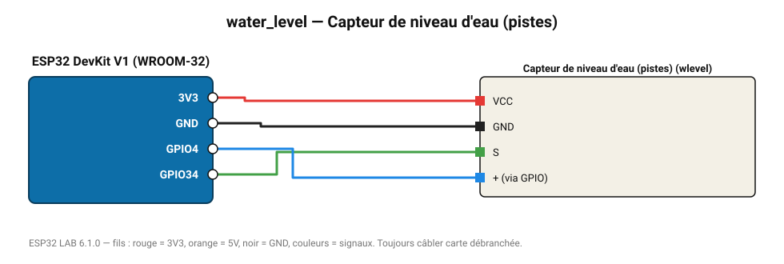

# Capteur de niveau d'eau (pistes)

Plaque à pistes parallèles : tension proportionnelle à la hauteur d'eau (0-4 cm).

**Carte :** ESP32 DevKit V1 (WROOM-32) — moniteur série 115200 bauds.

| ESP32 | Composant | Broche | Couleur fil | Remarque |
|---|---|---|---|---|
| 3V3 | Capteur de niveau d'eau (pistes) | VCC | rouge |  |
| GND | Capteur de niveau d'eau (pistes) | GND | noir |  |
| GPIO34 | Capteur de niveau d'eau (pistes) | S | vert |  |
| GPIO4 | Capteur de niveau d'eau (pistes) | + (via GPIO) | bleu |  |

Toujours câbler **carte débranchée**. Masse (GND) commune entre tous les modules.
