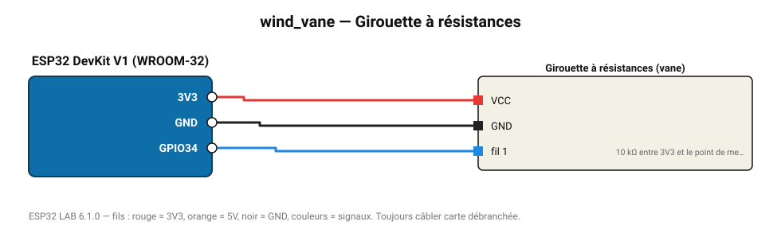

# Girouette à résistances

Girouette 16 positions (kit météo) : direction du vent en degrés via un pont diviseur 10 kΩ.

**Carte :** ESP32 DevKit V1 (WROOM-32) — moniteur série 115200 bauds.

| ESP32 | Composant | Broche | Couleur fil | Remarque |
|---|---|---|---|---|
| 3V3 | Girouette à résistances | VCC | rouge |  |
| GND | Girouette à résistances | GND | noir |  |
| GPIO34 | Girouette à résistances | fil 1 | bleu | 10 kΩ entre 3V3 et le point de mesure, fil 2 vers GND |

Toujours câbler **carte débranchée**. Masse (GND) commune entre tous les modules.
