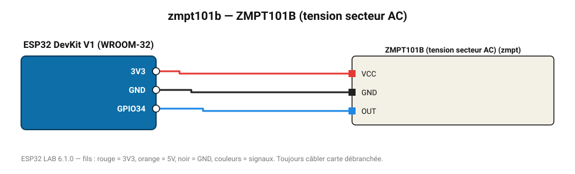

# ZMPT101B (tension secteur AC)

Transformateur de mesure isolé : tension efficace du secteur (étalonnage requis).

**Carte :** ESP32 DevKit V1 (WROOM-32) — moniteur série 115200 bauds.

| ESP32 | Composant | Broche | Couleur fil | Remarque |
|---|---|---|---|---|
| 3V3 | ZMPT101B (tension secteur AC) | VCC | rouge |  |
| GND | ZMPT101B (tension secteur AC) | GND | noir |  |
| GPIO34 | ZMPT101B (tension secteur AC) | OUT | bleu |  |

Toujours câbler **carte débranchée**. Masse (GND) commune entre tous les modules.
