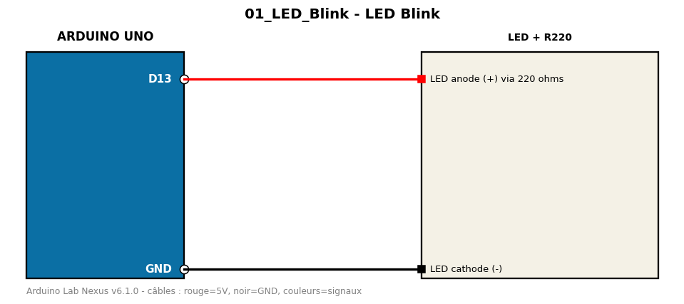

# LED Blink

Clignotement d'une LED externe sans delay() (millis).

**Composants :** LED + R220

**Bibliothèques :** aucune

| Arduino | Composant | Couleur fil |
|---|---|---|
| D13 | LED anode (+) via 220 ohms | red |
| GND | LED cathode (-) | black |

Moniteur série : 9600 bauds. Toujours câbler **carte débranchée**.
