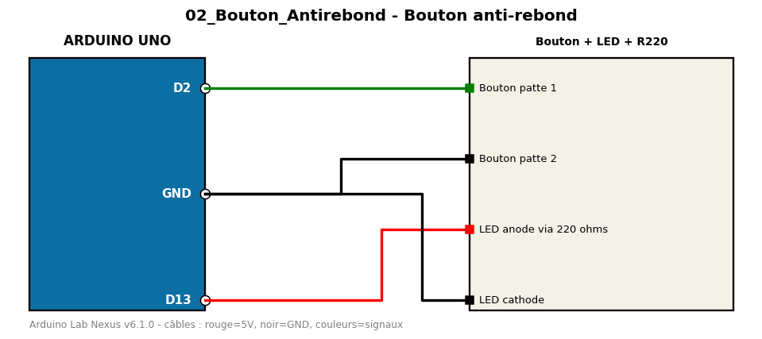

# Bouton anti-rebond

Bouton poussoir avec pull-up interne et anti-rebond logiciel, bascule une LED.

**Composants :** Bouton, LED + R220

**Bibliothèques :** aucune

| Arduino | Composant | Couleur fil |
|---|---|---|
| D2 | Bouton patte 1 | green |
| GND | Bouton patte 2 | black |
| D13 | LED anode via 220 ohms | red |
| GND | LED cathode | black |

Moniteur série : 9600 bauds. Toujours câbler **carte débranchée**.
