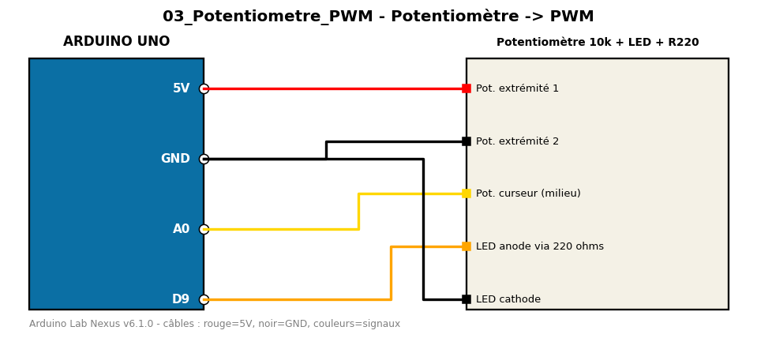

# Potentiomètre -> PWM

Lecture analogique d'un potentiomètre et variation de luminosité d'une LED (PWM).

**Composants :** Potentiomètre 10k, LED + R220

**Bibliothèques :** aucune

| Arduino | Composant | Couleur fil |
|---|---|---|
| 5V | Pot. extrémité 1 | red |
| GND | Pot. extrémité 2 | black |
| A0 | Pot. curseur (milieu) | gold |
| D9 | LED anode via 220 ohms | orange |
| GND | LED cathode | black |

Moniteur série : 9600 bauds. Toujours câbler **carte débranchée**.
