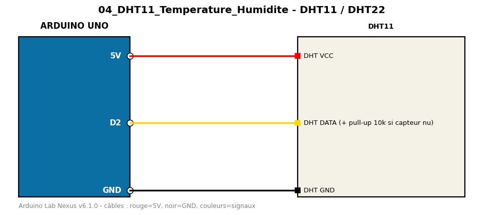

# DHT11 / DHT22

Mesure température et humidité avec un capteur DHT11 (ou DHT22).

**Composants :** DHT11

**Bibliothèques :** DHT sensor library, Adafruit Unified Sensor

| Arduino | Composant | Couleur fil |
|---|---|---|
| 5V | DHT VCC | red |
| D2 | DHT DATA (+ pull-up 10k si capteur nu) | gold |
| GND | DHT GND | black |

Moniteur série : 9600 bauds. Toujours câbler **carte débranchée**.
