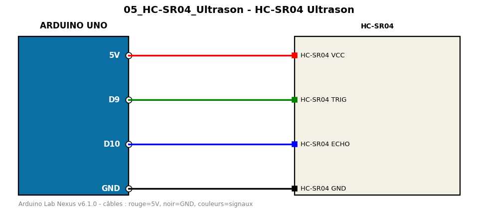

# HC-SR04 Ultrason

Mesure de distance par ultrasons avec timeout (aucune bibliothèque).

**Composants :** HC-SR04

**Bibliothèques :** aucune

| Arduino | Composant | Couleur fil |
|---|---|---|
| 5V | HC-SR04 VCC | red |
| D9 | HC-SR04 TRIG | green |
| D10 | HC-SR04 ECHO | blue |
| GND | HC-SR04 GND | black |

Moniteur série : 9600 bauds. Toujours câbler **carte débranchée**.
