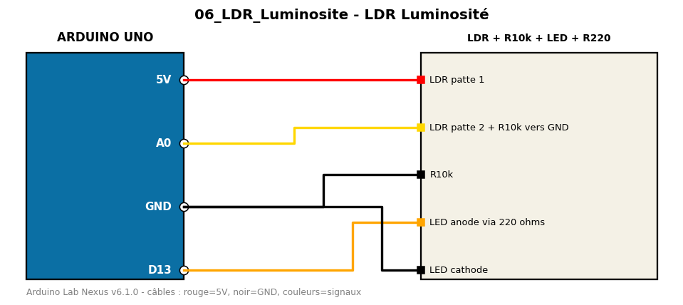

# LDR Luminosité

Photorésistance en pont diviseur ; allume une LED quand il fait sombre.

**Composants :** LDR + R10k, LED + R220

**Bibliothèques :** aucune

| Arduino | Composant | Couleur fil |
|---|---|---|
| 5V | LDR patte 1 | red |
| A0 | LDR patte 2 + R10k vers GND | gold |
| GND | R10k | black |
| D13 | LED anode via 220 ohms | orange |
| GND | LED cathode | black |

Moniteur série : 9600 bauds. Toujours câbler **carte débranchée**.
