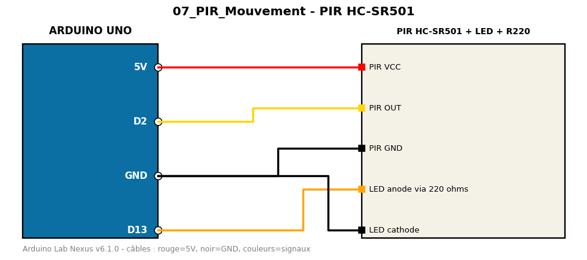

# PIR HC-SR501

Détection de mouvement infrarouge passif avec détection de fronts.

**Composants :** PIR HC-SR501, LED + R220

**Bibliothèques :** aucune

| Arduino | Composant | Couleur fil |
|---|---|---|
| 5V | PIR VCC | red |
| D2 | PIR OUT | gold |
| GND | PIR GND | black |
| D13 | LED anode via 220 ohms | orange |
| GND | LED cathode | black |

Moniteur série : 9600 bauds. Toujours câbler **carte débranchée**.
