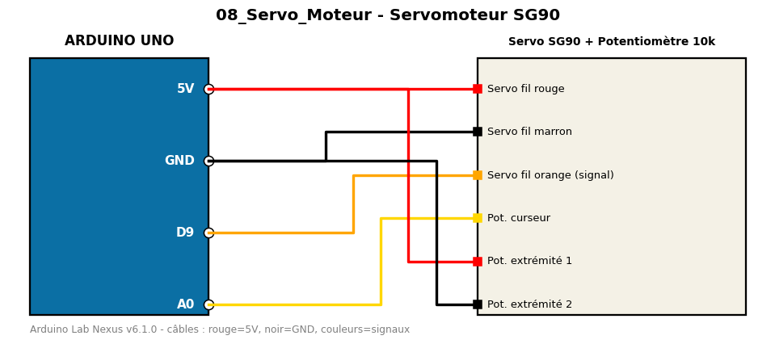

# Servomoteur SG90

Balayage 0-180° d'un servomoteur, piloté par potentiomètre.

**Composants :** Servo SG90, Potentiomètre 10k

**Bibliothèques :** Servo

| Arduino | Composant | Couleur fil |
|---|---|---|
| 5V | Servo fil rouge | red |
| GND | Servo fil marron | black |
| D9 | Servo fil orange (signal) | orange |
| A0 | Pot. curseur | gold |
| 5V | Pot. extrémité 1 | red |
| GND | Pot. extrémité 2 | black |

Moniteur série : 9600 bauds. Toujours câbler **carte débranchée**.
