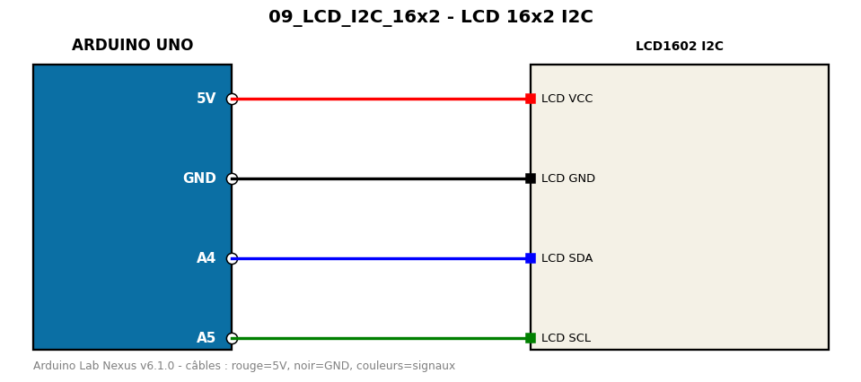

# LCD 16x2 I2C

Affichage sur écran LCD 1602 avec module I2C PCF8574 (adresse 0x27 ou 0x3F).

**Composants :** LCD1602 I2C

**Bibliothèques :** LiquidCrystal I2C

| Arduino | Composant | Couleur fil |
|---|---|---|
| 5V | LCD VCC | red |
| GND | LCD GND | black |
| A4 | LCD SDA | blue |
| A5 | LCD SCL | green |

Moniteur série : 9600 bauds. Toujours câbler **carte débranchée**.
