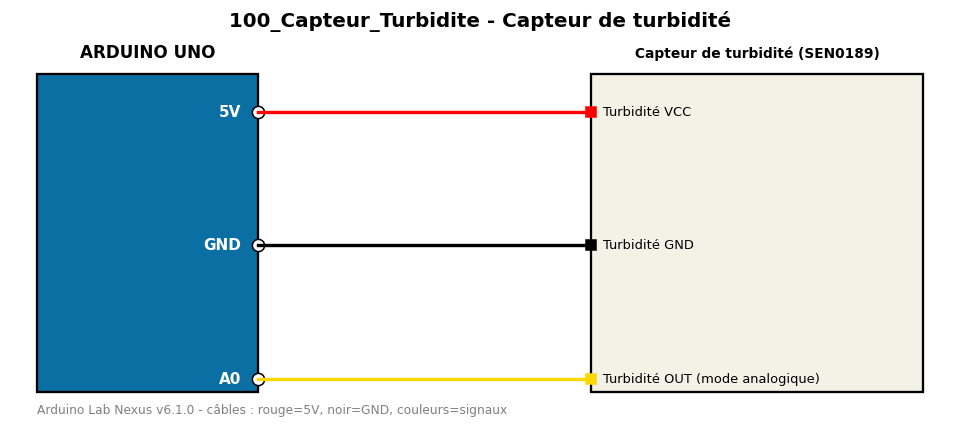

# Capteur de turbidité

Estime la turbidité (trouble) de l'eau avec un capteur analogique.

**Composants :** Capteur de turbidité (SEN0189)

**Bibliothèques :** aucune

| Arduino | Composant | Couleur fil |
|---|---|---|
| 5V | Turbidité VCC | red |
| GND | Turbidité GND | black |
| A0 | Turbidité OUT (mode analogique) | gold |

Moniteur série : 9600 bauds. Toujours câbler **carte débranchée**.
