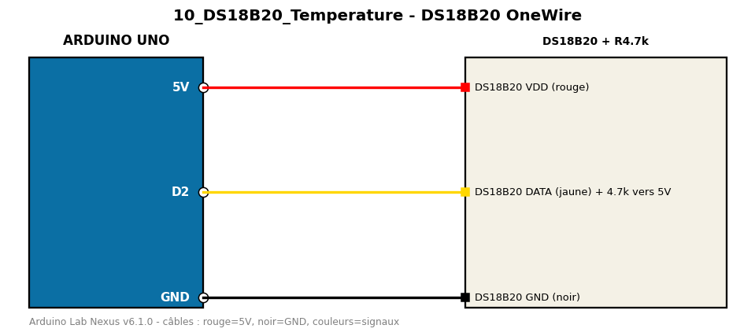

# DS18B20 OneWire

Sonde de température étanche DS18B20 sur bus OneWire.

**Composants :** DS18B20 + R4.7k

**Bibliothèques :** OneWire, DallasTemperature

| Arduino | Composant | Couleur fil |
|---|---|---|
| 5V | DS18B20 VDD (rouge) | red |
| D2 | DS18B20 DATA (jaune) + 4.7k vers 5V | gold |
| GND | DS18B20 GND (noir) | black |

Moniteur série : 9600 bauds. Toujours câbler **carte débranchée**.
