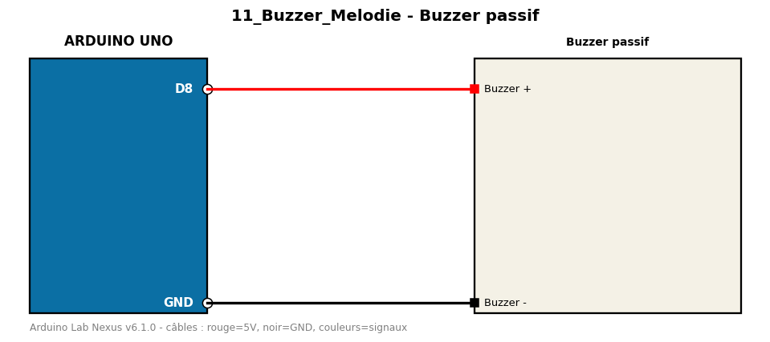

# Buzzer passif

Joue une mélodie (gamme) sur un buzzer passif avec tone().

**Composants :** Buzzer passif

**Bibliothèques :** aucune

| Arduino | Composant | Couleur fil |
|---|---|---|
| D8 | Buzzer + | red |
| GND | Buzzer - | black |

Moniteur série : 9600 bauds. Toujours câbler **carte débranchée**.
