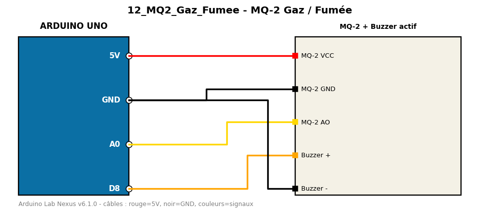

# MQ-2 Gaz / Fumée

Détection de gaz/fumée (sortie analogique + seuil) avec alarme buzzer.

**Composants :** MQ-2, Buzzer actif

**Bibliothèques :** aucune

| Arduino | Composant | Couleur fil |
|---|---|---|
| 5V | MQ-2 VCC | red |
| GND | MQ-2 GND | black |
| A0 | MQ-2 AO | gold |
| D8 | Buzzer + | orange |
| GND | Buzzer - | black |

Moniteur série : 9600 bauds. Toujours câbler **carte débranchée**.
