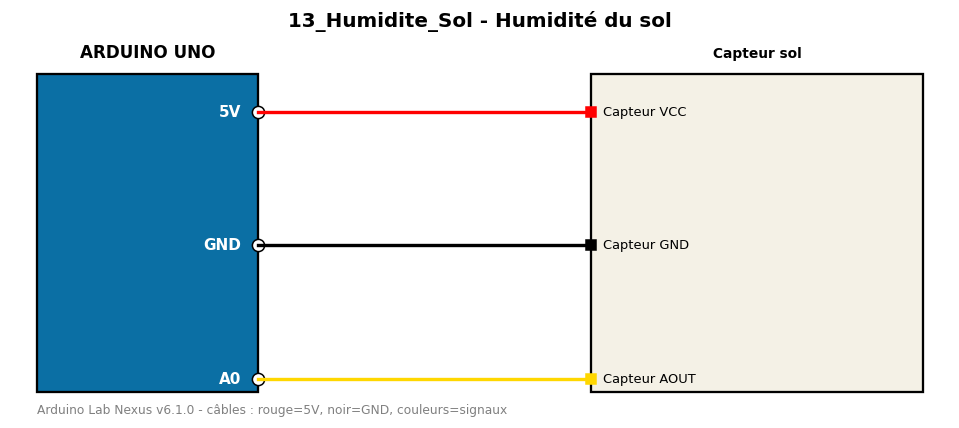

# Humidité du sol

Capteur capacitif/résistif d'humidité du sol converti en pourcentage.

**Composants :** Capteur sol

**Bibliothèques :** aucune

| Arduino | Composant | Couleur fil |
|---|---|---|
| 5V | Capteur VCC | red |
| GND | Capteur GND | black |
| A0 | Capteur AOUT | gold |

Moniteur série : 9600 bauds. Toujours câbler **carte débranchée**.
