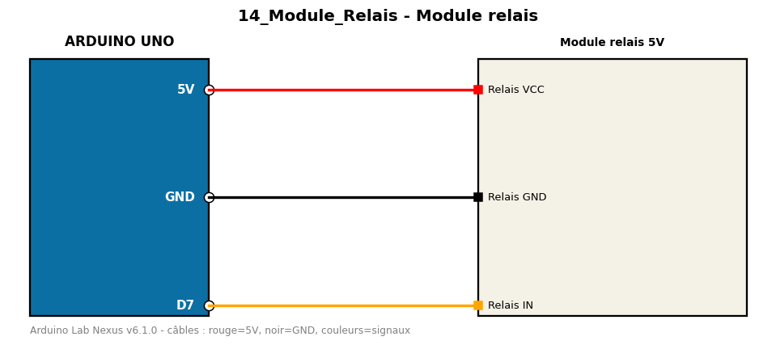

# Module relais

Commande d'un module relais 5V (charge externe) via le moniteur série (1/0).

**Composants :** Module relais 5V

**Bibliothèques :** aucune

| Arduino | Composant | Couleur fil |
|---|---|---|
| 5V | Relais VCC | red |
| GND | Relais GND | black |
| D7 | Relais IN | orange |

Moniteur série : 9600 bauds. Toujours câbler **carte débranchée**.
