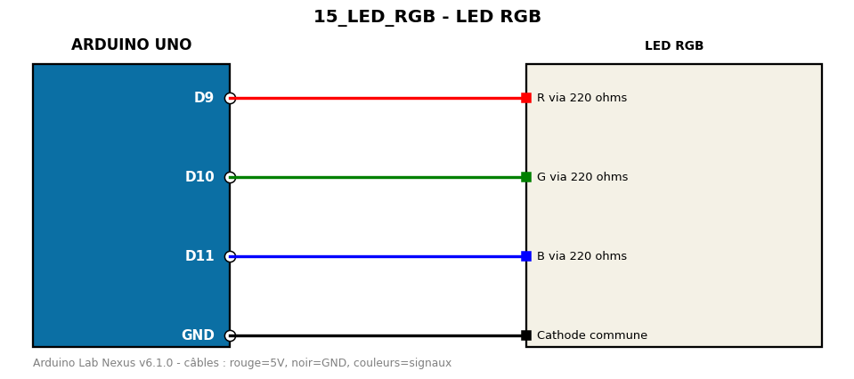

# LED RGB

Cycle de couleurs sur une LED RGB cathode commune (PWM).

**Composants :** LED RGB

**Bibliothèques :** aucune

| Arduino | Composant | Couleur fil |
|---|---|---|
| D9 | R via 220 ohms | red |
| D10 | G via 220 ohms | green |
| D11 | B via 220 ohms | blue |
| GND | Cathode commune | black |

Moniteur série : 9600 bauds. Toujours câbler **carte débranchée**.
