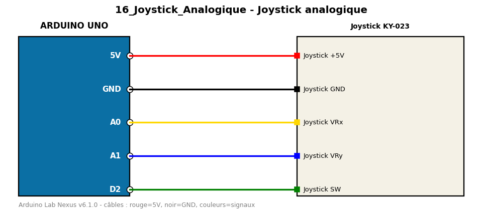

# Joystick analogique

Lecture des axes X/Y et du bouton d'un joystick KY-023.

**Composants :** Joystick KY-023

**Bibliothèques :** aucune

| Arduino | Composant | Couleur fil |
|---|---|---|
| 5V | Joystick +5V | red |
| GND | Joystick GND | black |
| A0 | Joystick VRx | gold |
| A1 | Joystick VRy | blue |
| D2 | Joystick SW | green |

Moniteur série : 9600 bauds. Toujours câbler **carte débranchée**.
