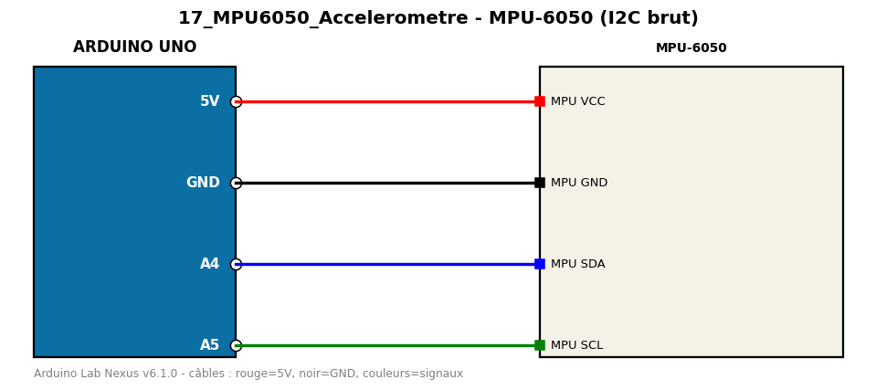

# MPU-6050 (I2C brut)

Accéléromètre/gyroscope MPU-6050 lu directement via Wire (aucune bibliothèque externe).

**Composants :** MPU-6050

**Bibliothèques :** aucune

| Arduino | Composant | Couleur fil |
|---|---|---|
| 5V | MPU VCC | red |
| GND | MPU GND | black |
| A4 | MPU SDA | blue |
| A5 | MPU SCL | green |

Moniteur série : 9600 bauds. Toujours câbler **carte débranchée**.
