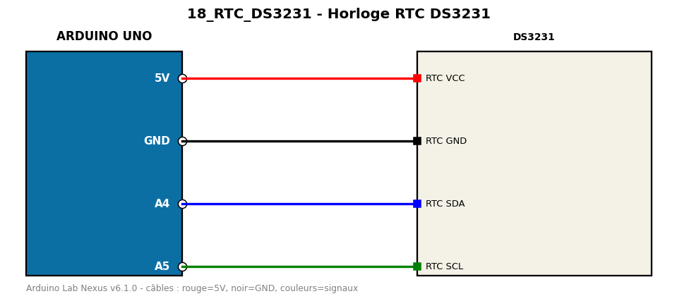

# Horloge RTC DS3231

Lecture de l'heure d'un module DS3231 via I2C (BCD), sans bibliothèque.

**Composants :** DS3231

**Bibliothèques :** aucune

| Arduino | Composant | Couleur fil |
|---|---|---|
| 5V | RTC VCC | red |
| GND | RTC GND | black |
| A4 | RTC SDA | blue |
| A5 | RTC SCL | green |

Moniteur série : 9600 bauds. Toujours câbler **carte débranchée**.
