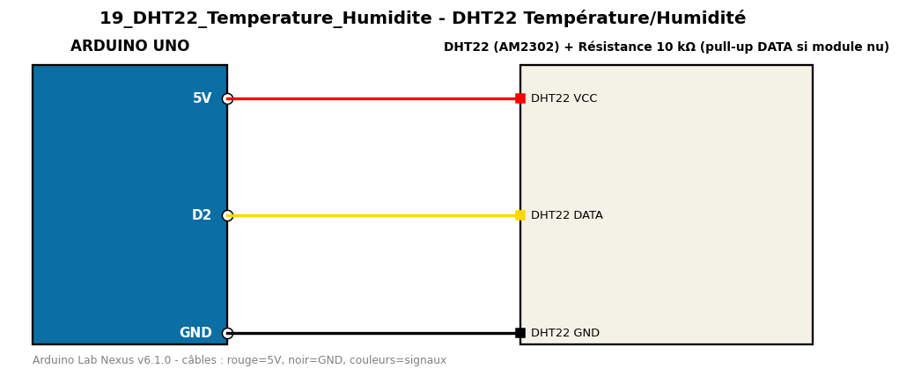

# DHT22 Température/Humidité

Lit la température et l'humidité d'un DHT22 toutes les 2 secondes.

**Composants :** DHT22 (AM2302), Résistance 10 kΩ (pull-up DATA si module nu)

**Bibliothèques :** DHT sensor library, Adafruit Unified Sensor

| Arduino | Composant | Couleur fil |
|---|---|---|
| 5V | DHT22 VCC | red |
| D2 | DHT22 DATA | gold |
| GND | DHT22 GND | black |

Moniteur série : 9600 bauds. Toujours câbler **carte débranchée**.
