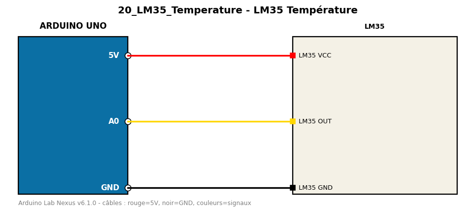

# LM35 Température

Mesure la température avec un LM35 (10 mV par °C) sur une entrée analogique.

**Composants :** LM35

**Bibliothèques :** aucune

| Arduino | Composant | Couleur fil |
|---|---|---|
| 5V | LM35 VCC | red |
| A0 | LM35 OUT | gold |
| GND | LM35 GND | black |

Moniteur série : 9600 bauds. Toujours câbler **carte débranchée**.
