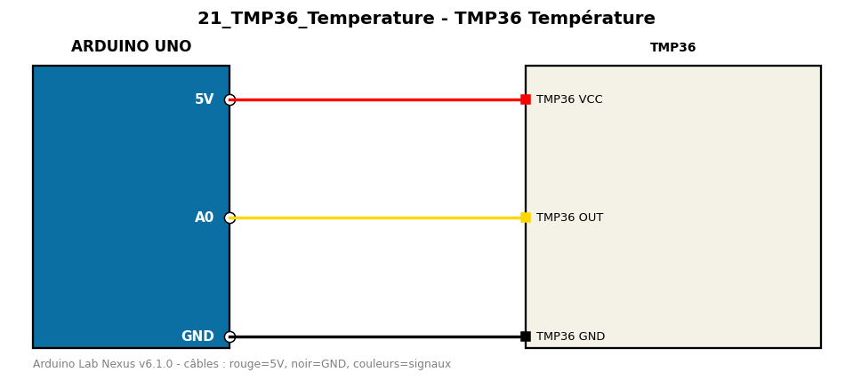

# TMP36 Température

Mesure la température avec un TMP36 (500 mV à 0 °C, 10 mV par °C).

**Composants :** TMP36

**Bibliothèques :** aucune

| Arduino | Composant | Couleur fil |
|---|---|---|
| 5V | TMP36 VCC | red |
| A0 | TMP36 OUT | gold |
| GND | TMP36 GND | black |

Moniteur série : 9600 bauds. Toujours câbler **carte débranchée**.
