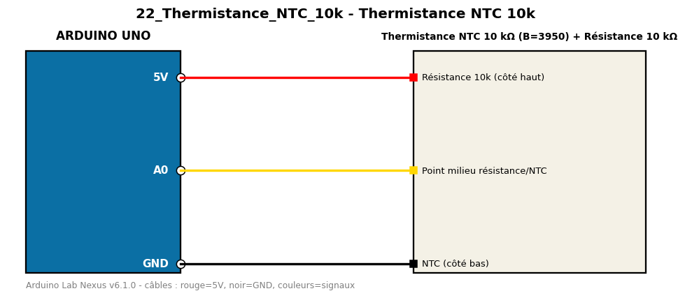

# Thermistance NTC 10k

Calcule la température d'une thermistance NTC 10 kΩ avec l'équation de Steinhart-Hart simplifiée (coefficient B).

**Composants :** Thermistance NTC 10 kΩ (B=3950), Résistance 10 kΩ

**Bibliothèques :** aucune

| Arduino | Composant | Couleur fil |
|---|---|---|
| 5V | Résistance 10k (côté haut) | red |
| A0 | Point milieu résistance/NTC | gold |
| GND | NTC (côté bas) | black |

Moniteur série : 9600 bauds. Toujours câbler **carte débranchée**.
