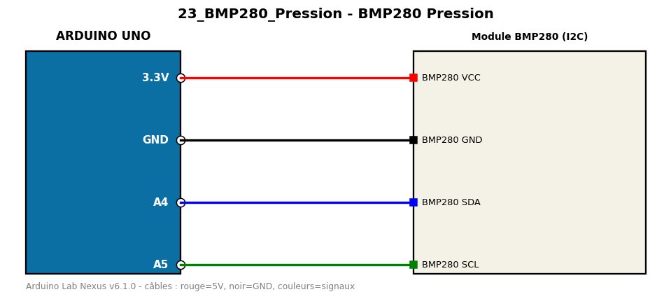

# BMP280 Pression

Lit la température, la pression et l'altitude estimée d'un BMP280 en I2C.

**Composants :** Module BMP280 (I2C)

**Bibliothèques :** Adafruit BMP280 Library, Adafruit Unified Sensor, Adafruit BusIO

| Arduino | Composant | Couleur fil |
|---|---|---|
| 3.3V | BMP280 VCC | red |
| GND | BMP280 GND | black |
| A4 | BMP280 SDA | blue |
| A5 | BMP280 SCL | green |

Moniteur série : 9600 bauds. Toujours câbler **carte débranchée**.
