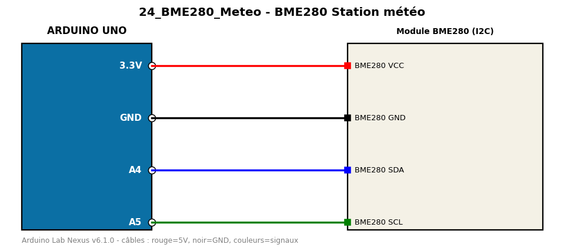

# BME280 Station météo

Lit température, humidité et pression d'un BME280 en I2C.

**Composants :** Module BME280 (I2C)

**Bibliothèques :** Adafruit BME280 Library, Adafruit Unified Sensor, Adafruit BusIO

| Arduino | Composant | Couleur fil |
|---|---|---|
| 3.3V | BME280 VCC | red |
| GND | BME280 GND | black |
| A4 | BME280 SDA | blue |
| A5 | BME280 SCL | green |

Moniteur série : 9600 bauds. Toujours câbler **carte débranchée**.
