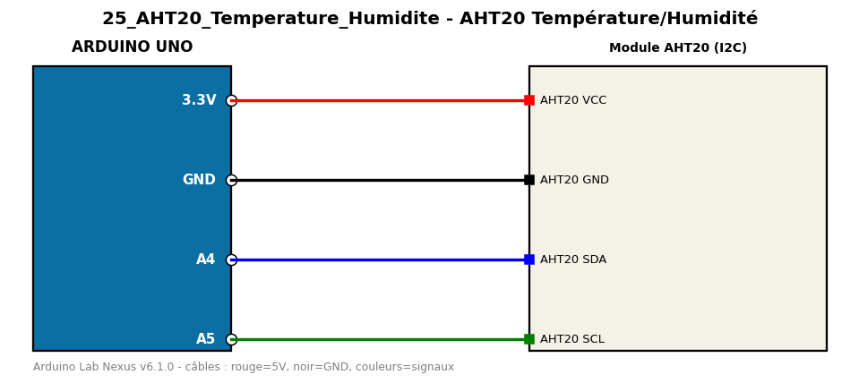

# AHT20 Température/Humidité

Lit la température et l'humidité d'un AHT20 en I2C.

**Composants :** Module AHT20 (I2C)

**Bibliothèques :** Adafruit AHTX0, Adafruit BusIO, Adafruit Unified Sensor

| Arduino | Composant | Couleur fil |
|---|---|---|
| 3.3V | AHT20 VCC | red |
| GND | AHT20 GND | black |
| A4 | AHT20 SDA | blue |
| A5 | AHT20 SCL | green |

Moniteur série : 9600 bauds. Toujours câbler **carte débranchée**.
