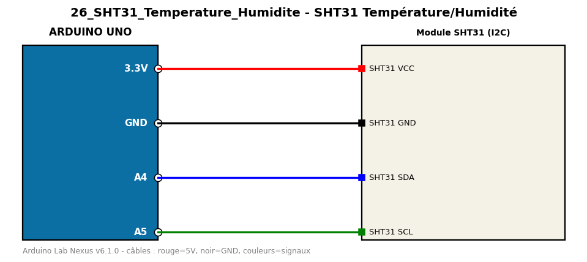

# SHT31 Température/Humidité

Lit la température et l'humidité d'un SHT31 de précision en I2C.

**Composants :** Module SHT31 (I2C)

**Bibliothèques :** Adafruit SHT31 Library, Adafruit BusIO

| Arduino | Composant | Couleur fil |
|---|---|---|
| 3.3V | SHT31 VCC | red |
| GND | SHT31 GND | black |
| A4 | SHT31 SDA | blue |
| A5 | SHT31 SCL | green |

Moniteur série : 9600 bauds. Toujours câbler **carte débranchée**.
