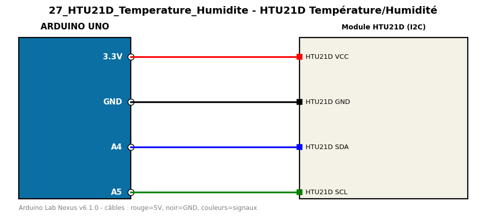

# HTU21D Température/Humidité

Lit la température et l'humidité d'un HTU21D en I2C.

**Composants :** Module HTU21D (I2C)

**Bibliothèques :** Adafruit HTU21DF Library, Adafruit BusIO

| Arduino | Composant | Couleur fil |
|---|---|---|
| 3.3V | HTU21D VCC | red |
| GND | HTU21D GND | black |
| A4 | HTU21D SDA | blue |
| A5 | HTU21D SCL | green |

Moniteur série : 9600 bauds. Toujours câbler **carte débranchée**.
