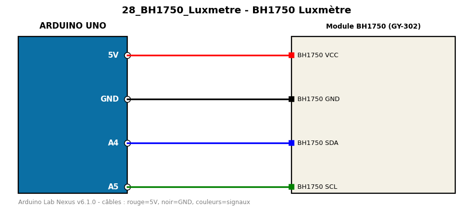

# BH1750 Luxmètre

Mesure l'éclairement lumineux en lux avec un BH1750 en I2C.

**Composants :** Module BH1750 (GY-302)

**Bibliothèques :** BH1750

| Arduino | Composant | Couleur fil |
|---|---|---|
| 5V | BH1750 VCC | red |
| GND | BH1750 GND | black |
| A4 | BH1750 SDA | blue |
| A5 | BH1750 SCL | green |

Moniteur série : 9600 bauds. Toujours câbler **carte débranchée**.
